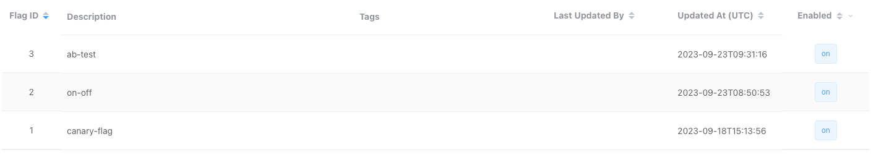

# How to Run OpenFeatureCanaryDemoApp


```shell
# prepare flagr (feature toggle system)
docker compose -f Docker/flagr-docker-compose.yaml -p flagr up
# then run the application (by IDE)
```

## flagr setting


### config for on-off
```json
{
  "dataRecordsEnabled": false,
  "description": "on-off",
  "enabled": true,
  "id": 2,
  "key": "on-off",
  "segments": [
    {
      "constraints": [],
      "description": "Release-Phase",
      "distributions": [
        {
          "id": 19,
          "percent": 100,
          "variantID": 3,
          "variantKey": "on"
        }
      ],
      "id": 2,
      "rank": 999,
      "rolloutPercent": 100
    }
  ],
  "tags": [],
  "updatedAt": "2023-09-23T08:14:45.871Z",
  "variants": [
    {
      "attachment": {},
      "id": 3,
      "key": "on"
    },
    {
      "attachment": {},
      "id": 4,
      "key": "off"
    }
  ]
}
```

### config for canary-falg
```json
{
  "dataRecordsEnabled": false,
  "description": "canary-flag",
  "enabled": true,
  "id": 1,
  "key": "canary-flag",
  "segments": [
    {
      "constraints": [],
      "description": "Default",
      "distributions": [
        {
          "id": 16,
          "percent": 75,
          "variantID": 1,
          "variantKey": "v1"
        },
        {
          "id": 17,
          "percent": 25,
          "variantID": 2,
          "variantKey": "v2"
        }
      ],
      "id": 1,
      "rank": 999,
      "rolloutPercent": 100
    }
  ],
  "tags": [],
  "updatedAt": "2023-09-17T10:23:09.094Z",
  "variants": [
    {
      "attachment": {},
      "id": 1,
      "key": "v1"
    },
    {
      "attachment": {},
      "id": 2,
      "key": "v2"
    }
  ]
}
```

### config for ab-test
```json
{
  "dataRecordsEnabled": false,
  "description": "ab-test",
  "enabled": true,
  "id": 3,
  "key": "ab-test",
  "segments": [
    {
      "constraints": [
        {
          "id": 1,
          "operator": "EQ",
          "property": "region",
          "value": "\"Asia\""
        }
      ],
      "description": "Asia",
      "distributions": [
        {
          "id": 20,
          "percent": 100,
          "variantID": 5,
          "variantKey": "v1"
        }
      ],
      "id": 3,
      "rank": 999,
      "rolloutPercent": 100
    },
    {
      "constraints": [
        {
          "id": 2,
          "operator": "EQ",
          "property": "region",
          "value": "\"Europe\""
        }
      ],
      "description": "Europe",
      "distributions": [
        {
          "id": 21,
          "percent": 100,
          "variantID": 6,
          "variantKey": "v2"
        }
      ],
      "id": 4,
      "rank": 999,
      "rolloutPercent": 100
    },
    {
      "constraints": [],
      "description": "Defualt",
      "distributions": [
        {
          "id": 22,
          "percent": 50,
          "variantID": 5,
          "variantKey": "v1"
        },
        {
          "id": 23,
          "percent": 50,
          "variantID": 6,
          "variantKey": "v2"
        }
      ],
      "id": 5,
      "rank": 999,
      "rolloutPercent": 100
    }
  ],
  "tags": [],
  "updatedAt": "2023-09-23T09:30:27.644Z",
  "variants": [
    {
      "attachment": {},
      "id": 5,
      "key": "v1"
    },
    {
      "attachment": {},
      "id": 6,
      "key": "v2"
    }
  ]
}
```

## Demo screenshot
